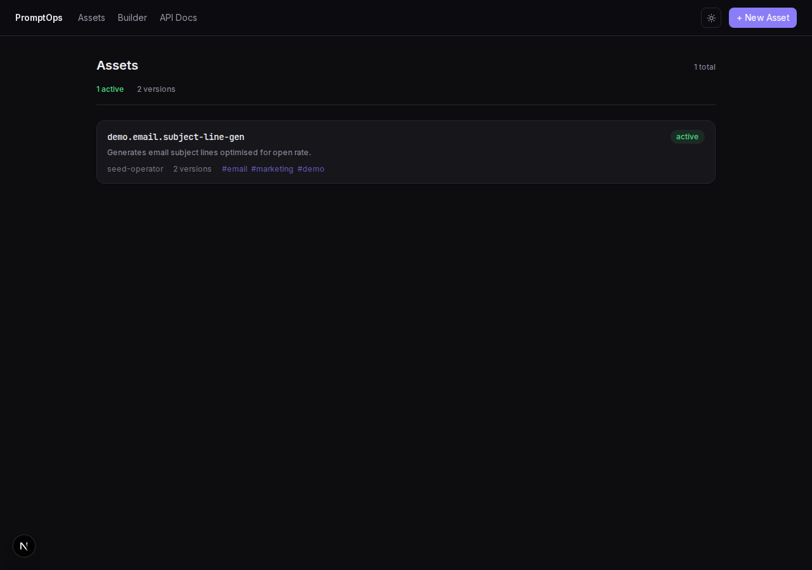
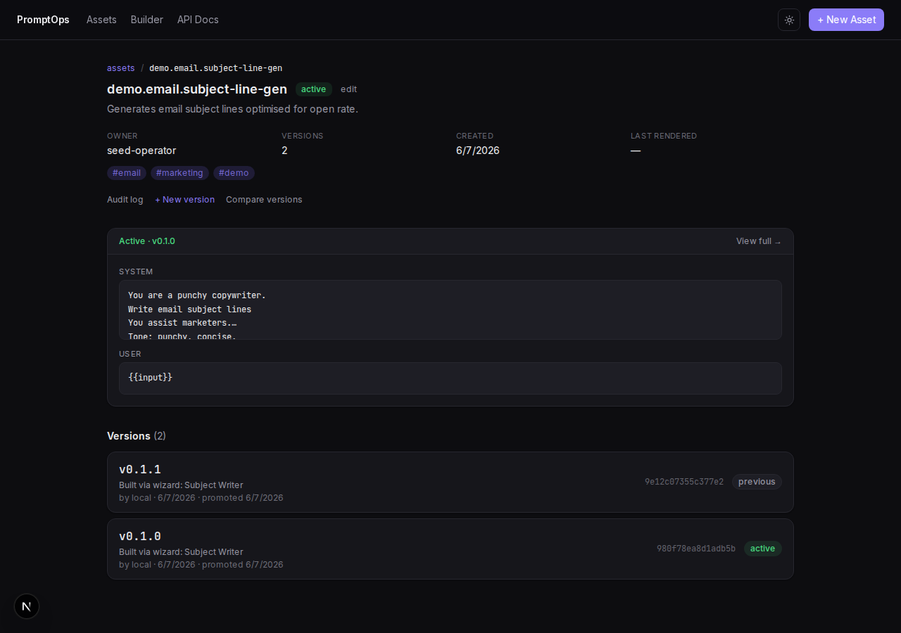
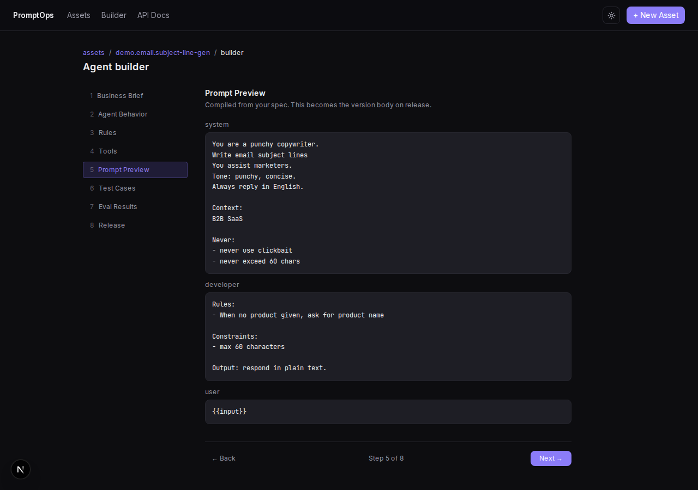
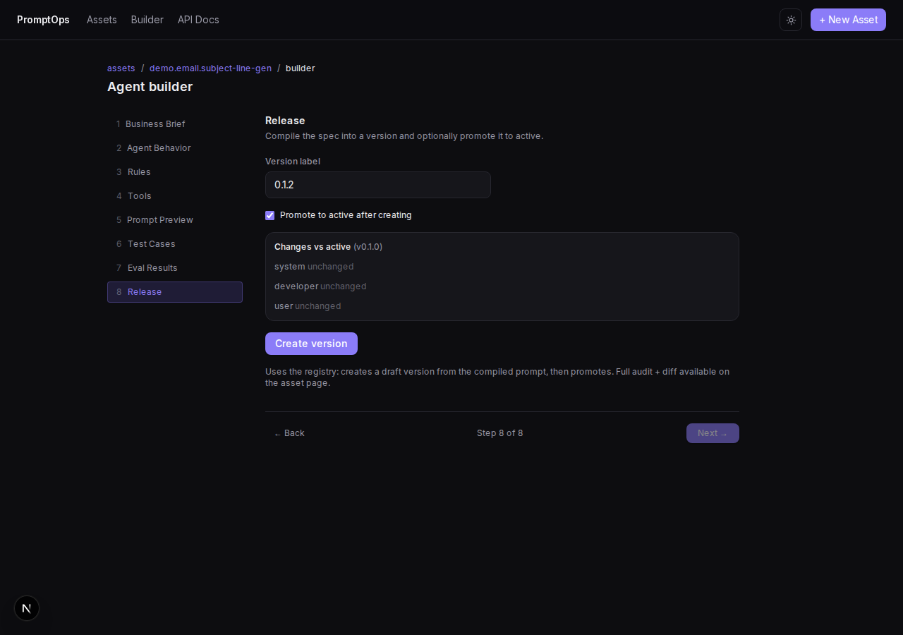

# PromptOps

> Prompts are production assets. Version them, test them, diff them, and gate releases — like code, not notes in a Notion page.

[](https://github.com/Qalipso/promptops-tool/actions/workflows/promptops-ci.yml)
&nbsp;109+ tests &nbsp;·&nbsp; TypeScript &nbsp;·&nbsp; local-first

PromptOps is a **local-first prompt operations tool**. It treats every prompt as a versioned, testable, releasable asset — with a registry, semantic versioning, diffing, an append-only audit log, a CLI, and a guided **agent builder**. No cloud, no database server, no LLM calls: clone, `pnpm start:local`, and own your prompt lifecycle on your machine.



---

## Why

In production AI, the prompt is often the **single point of failure**. A one-line system-prompt edit can silently break classification accuracy, tone, or JSON structure — and the regression shows up in support tickets, not a test run. PromptOps applies engineering discipline to prompts: version control, diffs, an explicit release gate, and a full audit trail.

## Features

- **Registry + semantic versioning** — stable asset IDs, content-hash version identity, draft → active → previous lifecycle.
- **Diff** — line + structured diff between any two versions (pure, dependency-free LCS).
- **Render** — template `{{variable}}` substitution with unresolved/unused detection. No LLM call.
- **Append-only audit log** — every create/promote/archive/rollback/eval event is immutable evidence.
- **Agent Builder** — guided 8-step wizard (Brief → Behavior → Rules → Tools → Preview → Test Cases → Eval → Release) that compiles a spec into a versioned prompt. Shows a diff-vs-active before you promote.
- **CLI** — zero-dependency `promptops` for the whole lifecycle, plus git-friendly YAML export/import.
- **Eval ingest** — import an eval results `.txt` from an external evaluator; PromptOps stores and displays, it does not run evals.

## Quick start

```bash
cd projects/promptops-tool/app
pnpm install
pnpm start:local        # migrate + seed + API :3013 + web :3014
```

Open http://localhost:3014. SQLite auto-creates at `~/.promptops/promptops.db`. Local mode bypasses auth (`actor = local`).

**Troubleshooting:** the web talks to the API over `127.0.0.1:3013` (IPv4 — `localhost` resolves to IPv6 first and would refuse). If pages show "Can't reach the PromptOps API", the API isn't up — re-run `pnpm start:local`, or `pnpm --filter @promptops/api dev`. After a Postgres→SQLite-era checkout, run `pnpm --filter @promptops/api build` before `pnpm --filter @promptops/api start` (prod path reads `dist/`).

## Screenshots

| Asset detail | Agent builder — preview | Builder — release diff |
|---|---|---|
|  |  |  |

Light + dark themes included. Regenerate with `pnpm capture` (needs `start:local` running).

## CLI

```bash
pnpm cli list                                   # all assets
pnpm cli show <asset>                            # detail + versions
pnpm cli version new <asset> <ver> -m "msg"      # draft (opens $EDITOR)
pnpm cli promote <asset> <ver>                   # draft → active
pnpm cli render <asset> <ver> -i name=Sam        # template render, no LLM
pnpm cli diff <asset> <verA> <verB>              # body + model-config diff
pnpm cli rollback <asset> --reason "..."         # restore previous active
pnpm cli export <asset> --out asset.yaml         # git-friendly export
pnpm cli import asset.yaml                        # recreate from YAML
pnpm cli builder compile <asset>                 # compile builder spec → prompt
pnpm cli builder release <asset> <ver>           # spec → version → promote
```

Or build a global binary: `pnpm --filter @promptops/cli build && node apps/cli/dist/main.js list`.

## Architecture

```
app/
├── apps/
│   ├── api/      Hono + Drizzle + SQLite (better-sqlite3)
│   ├── web/      Next.js 15 — console + Agent Builder (dark/light)
│   └── cli/      zero-dep Node CLI (parseArgs + fetch)
└── packages/
    ├── domain/   Zod schemas / shared types
    ├── diff/     pure line + structured diff (8 tests)
    └── builder/  pure spec→prompt compiler, test-gen, eval parser (11 tests)
```

Pure logic lives in `packages/*` (no I/O, fully unit-tested). API is layered routes → services → repos → schema. Engine details + decisions in [`ENGINEERING-NOTES.md`](ENGINEERING-NOTES.md).

## Tests & checks

```bash
pnpm -r lint        # biome
pnpm -r typecheck   # tsc --noEmit
pnpm -r test        # vitest — 109+ tests
```

CI (GitHub Actions) runs lint → typecheck → test → coverage gate (diff/builder ≥80%) → build on every push.

## Live demo (read-only)

A read-only demo (sample data, write actions disabled) can be deployed to Vercel:

- Root directory: `projects/promptops-tool/app/apps/web`
- Env: `DEMO_MODE=true`, `NEXT_PUBLIC_DEMO_MODE=true`
- `vercel.json` is preconfigured (`pnpm --filter=@promptops/web... build`).

```bash
cd app/apps/web && vercel    # deploy with the env vars above
```

## Docs

Spec + design docs (kept in sync with the code):
[`product-brief.md`](product-brief.md) · [`behavior-spec.md`](behavior-spec.md) · [`architecture.md`](architecture.md) · [`ENGINEERING-NOTES.md`](ENGINEERING-NOTES.md) · [`CASE-STUDY.md`](CASE-STUDY.md) · [`app/README.md`](app/README.md)
