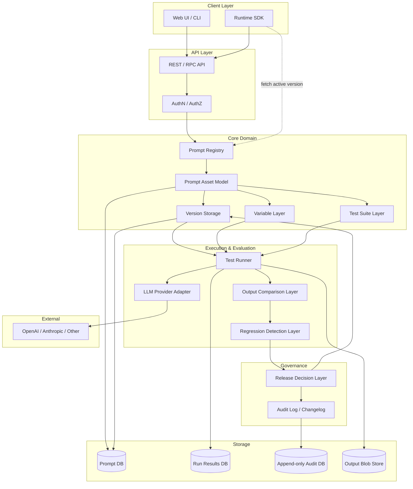

# Architecture — PromptOps

## System Diagram

---

## Layers

### 1. Prompt Registry
- The entry point. Maps human-readable prompt IDs (`shadow.daily-classifier`) to asset records.
- Resolves "give me the active version of asset X" in a single lookup. This is the hot path used by production runtime SDKs.
- Caches active version pointers aggressively; invalidates on promote/rollback.

### 2. Prompt Asset Model
- The canonical representation of a managed prompt: ID, owner, description, input contract (variables), output contract, model config profile, list of versions, active version pointer.
- Holds metadata that does not change per version: ownership, tags, project, lifecycle status.

### 3. Version Storage
- Immutable store of every prompt version ever created.
- Each record: version ID, parent version ID, prompt body, variable contract snapshot, model config snapshot, author, created-at, state (`draft` / `active` / `previous` / `archived`).
- Content-addressed: the storage key includes a hash of the prompt body so identical bodies dedupe naturally.

### 4. Variable Layer
- Validates inputs against the declared variable contract before any LLM call.
- Applies defaults for omitted optional variables.
- Renders the prompt template by substituting variables into the prompt body (single render strategy; no nested templating in MVP).

### 5. Test Suite Layer
- Owns the test cases per asset.
- Snapshots the suite when a version is promoted so historical runs stay reproducible.
- Supports assertion types: exact, JSON-schema, contains, semantic-similarity, custom-function, LLM-judge.

### 6. Test Runner
- Orchestrates execution of a suite against a specific version.
- Handles determinism controls: temperature pinning, seed pinning, N-runs-per-case.
- Records latency, token usage, cost per call. Enforces per-run cost caps.
- Writes raw + parsed outputs to the Output Blob Store and metrics to the Run Results DB.

### 7. Output Comparison Layer
- Pairs outputs from two version runs (typically `active` vs `draft`) per test case.
- Produces structured diffs:
  - Free-text outputs → sentence-level diff + cosine similarity score.
  - JSON outputs → field-level diff.
- Surfaces the comparison in a side-by-side view.

### 8. Regression Detection Layer
- Classifies each test case transition: `PASS→PASS`, `PASS→FAIL`, `FAIL→PASS`, `FAIL→FAIL`.
- Categorizes severity: hard (assertion failure), soft (similarity drop), perf (latency/cost regression).
- Emits a release-blocking signal for hard regressions unless explicitly overridden.

### 9. Release Decision Layer
- The gate between "this version exists" and "this version is in production."
- Enforces preconditions: minimum test count, no unresolved hard regressions (or justified override), explicit human confirmation.
- Performs the atomic state transition: previous active → `previous`, draft → `active`.
- Generates the structured release notes.
- Supports rollback as a first-class operation: re-promote a `previous` version with one click and a logged reason.

### 10. Audit Log / Changelog
- Append-only event log of every state-changing operation.
- Powers compliance, debugging, and the "what was the prompt on date X" query.
- Cold-tiered after 90 days; never deleted.

---

## Cross-Cutting Concerns

### Determinism
The runner is the only component that touches the LLM. All non-determinism is contained there. The rest of the system operates on stored outputs and is fully deterministic.

### Idempotency
All write operations carry an idempotency key. Reposting the same promote action twice is a no-op, not a double-promote.

### Provider Adapter
Single interface, multiple backends. New providers (OpenAI, Anthropic, local) implement a thin adapter. The core knows nothing about provider-specific fields.

### Runtime SDK
A thin client used in production apps. Single responsibility: fetch the active version of an asset by ID and render it with inputs. Reads from the Registry's hot cache.

### Storage Boundaries
- `PromptDB`: assets, versions, variable contracts, test suite definitions. Row-oriented, transactional.
- `RunDB`: per-run metrics (latency, tokens, cost, pass/fail). Append-heavy, analytical.
- `AuditDB`: append-only event log. Immutable.
- `BlobStore`: raw + parsed LLM outputs. Object storage, content-addressed.

This separation lets each store be tuned for its workload without cross-contamination.
