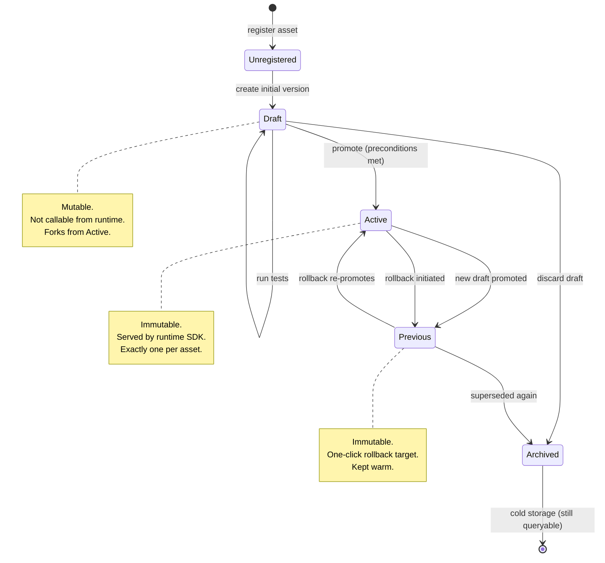

# Diagram — Prompt Lifecycle

## Explanation

The lifecycle has four states and only the `Draft` state is mutable. Every promotion is an atomic transition that shifts the previously active version to `Previous` and the draft to `Active`. Rollback is symmetric: a `Previous` version can be re-promoted at any time. Archived versions are never deleted — they remain queryable for audit and historical lookups, just hidden from the day-to-day UI.

This shape is intentional. By making `Draft` the only mutable state and forcing every other state to be immutable, the system makes "what was the prompt at time X" answerable with a single point lookup.
