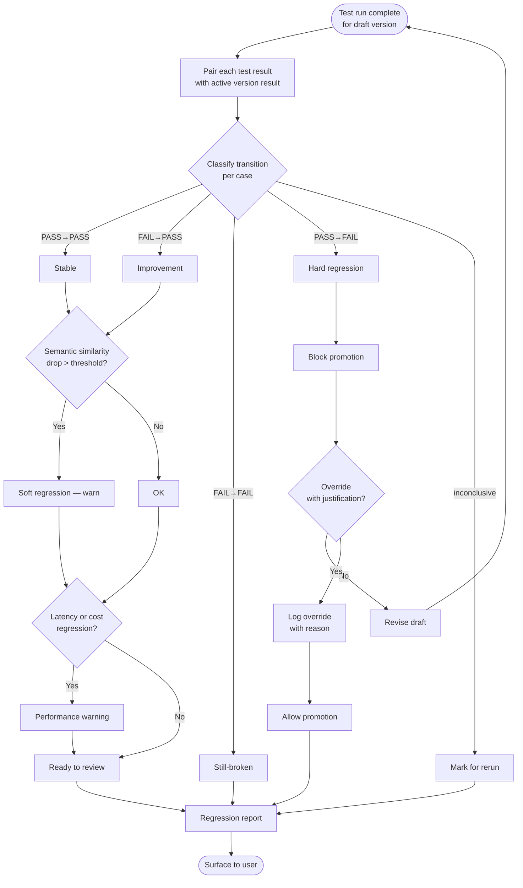

# Diagram — Regression Detection Flow

## Explanation

Regression detection is a per-case classification followed by severity layering. The hot path is "PASS → FAIL" which blocks promotion by default. Soft and performance regressions emit warnings but never block. Inconclusive results (provider error, parse error) are flagged for rerun, never silently converted to pass or fail.

Overrides are intentionally friction-bearing: they require written justification and are recorded in the audit log. This makes "I overrode a regression because I was in a hurry" a visible decision rather than an invisible one.
