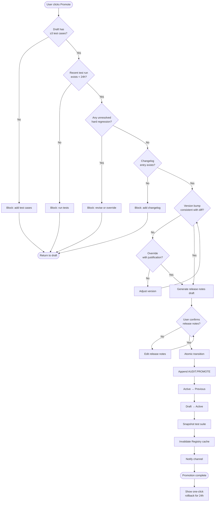

# Diagram — Release Decision Flow

## Explanation

Release decision is a gated pipeline. Each precondition is checked sequentially; any failure halts the flow with a specific remediation message. The atomic transition block runs as a single unit — either every step completes or the system stays on the previous active version. The audit log entry is written *before* the state mutation so that an audit gap is impossible: every state change has a preceding log line, even if the mutation itself were to fail.

The 24-hour rollback affordance is shown front and center after promotion. The expectation is that most regressions that escape pre-promotion checks reveal themselves quickly in production, and rollback should remain frictionless during that window.
