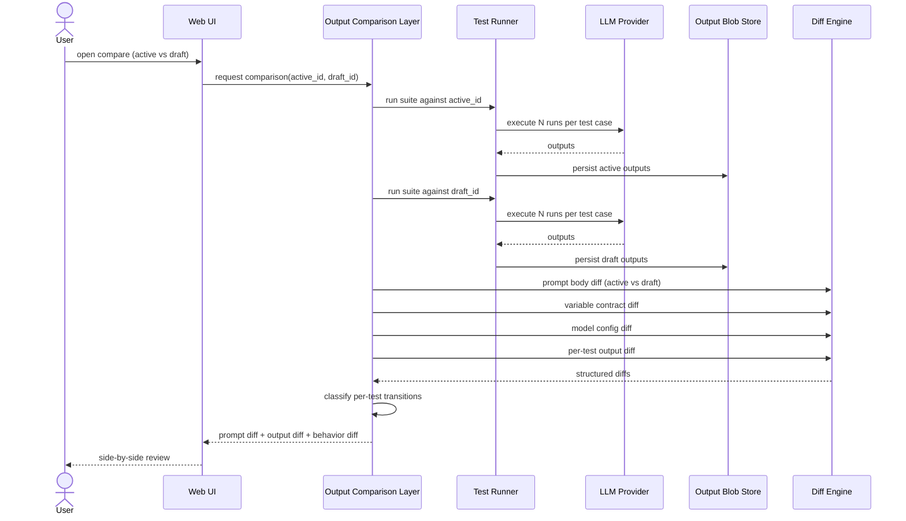

# Diagram — Version Comparison Flow

## Explanation

Comparison is not "compute on the fly." It runs both versions against the same test suite snapshot, persists both output sets to the blob store, then computes three diffs in parallel: the textual prompt diff, the structured contract/config diff, and the per-test output diff. The classification step (`PASS→PASS`, `PASS→FAIL`, etc.) turns raw outputs into the behavior diff the user actually reads first.

Caching is aggressive: if the active version was run within the comparison window and the suite snapshot has not changed, the active run is reused. Only the draft is guaranteed to re-run.
