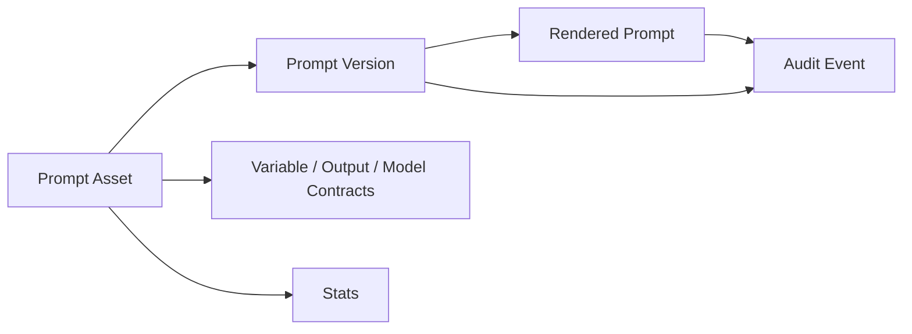
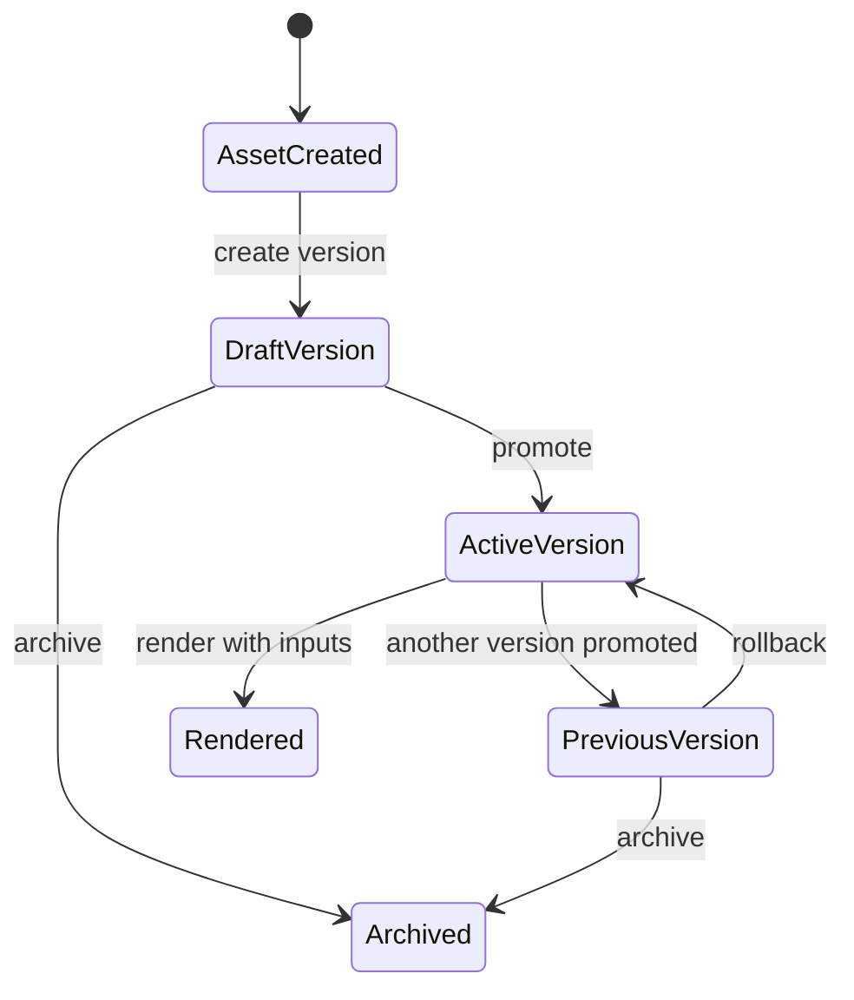
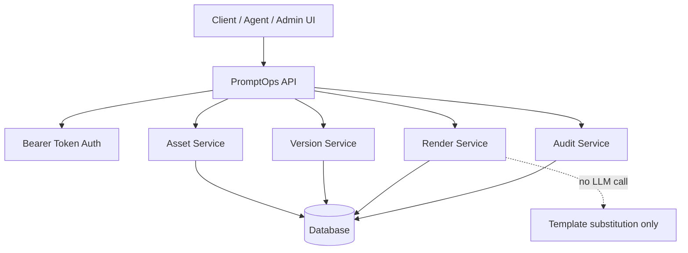
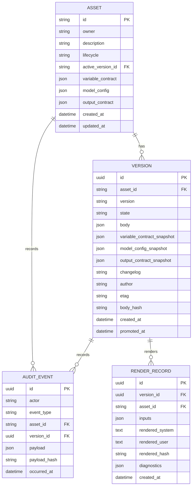
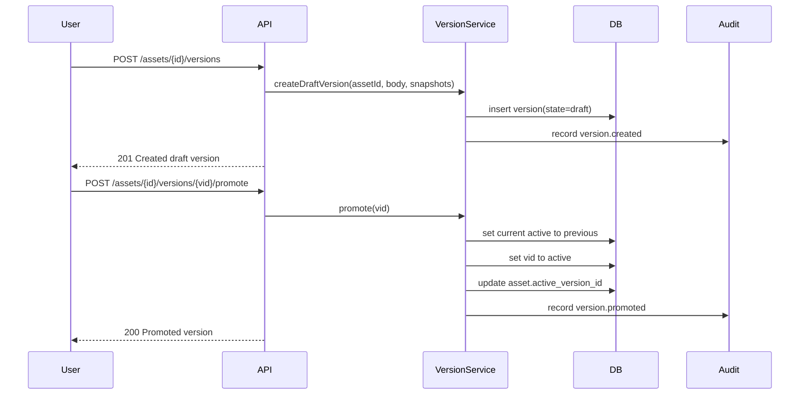
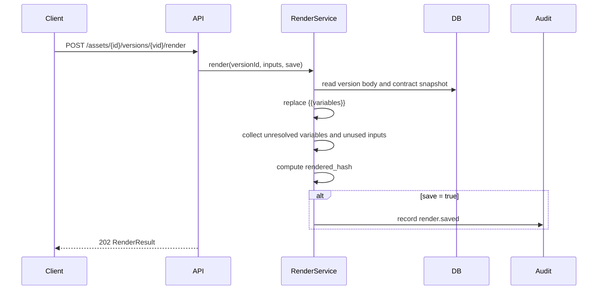
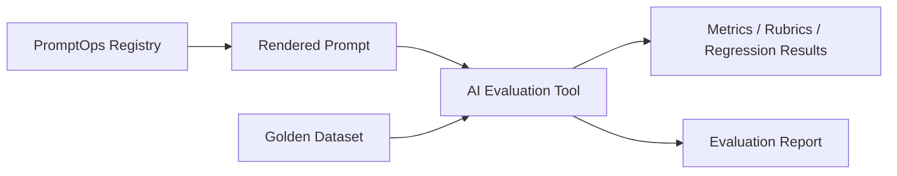
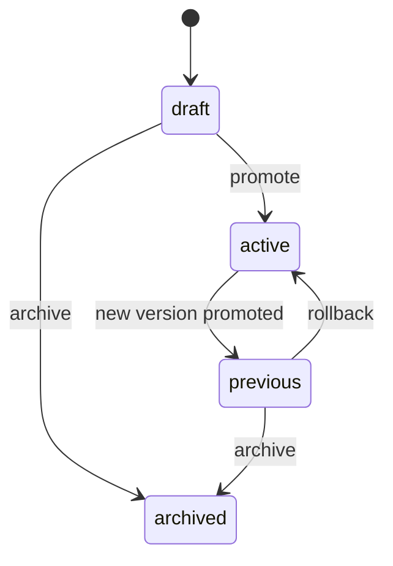

# PromptOps — Reworked Documentation Pack

This file combines the core docs for quick review. For the structured documentation package, use the folder files.

---

# PromptOps

**PromptOps is a prompt asset registry for AI products that need controlled prompt storage, versioning, rendering, rollback, and auditability.**

It is intentionally **not** an AI evaluation tool and it does **not** call an LLM. PromptOps manages prompt assets before they are used by agents, applications, or external evaluation systems.

## Why this exists

In real AI products, prompts quickly become production assets. They are edited, copied, tested, promoted, rolled back, reused by agents, and referenced in product decisions. Without a registry, teams lose answers to basic questions:

- Which prompt version is active right now?
- What changed between versions?
- Which variables are required to render this prompt safely?
- What exact prompt text was rendered for a specific run?
- Can we roll back after a bad release?
- Who changed what, and when?

PromptOps turns prompts into traceable product artifacts.

## What PromptOps does

| Capability | Purpose |
|---|---|
| **Asset registry** | Stores stable prompt assets with owner, tags, lifecycle, and contracts. |
| **Version control** | Creates draft versions, promotes one active version, archives old versions, and supports rollback. |
| **Template rendering** | Replaces `{{variables}}` with provided inputs and returns diagnostics. |
| **Audit trail** | Records important events so prompt changes and renders can be inspected later. |

## What PromptOps does not do

PromptOps does not evaluate prompt quality, compare outputs, run LLM calls, score rubrics, perform red teaming, or manage datasets. Those belong in a separate **AI Evaluation** tool.

```text
PromptOps = prompt storage, versions, contracts, rendering, audit
AI Evaluation = datasets, model runs, rubrics, LLM-as-judge, regression tests
```

## Core object model



## Main lifecycle



## Quick API flow

```bash
export PROMPTOPS_API_TOKEN="local-dev-token"
export BASE_URL="http://localhost:3013"
```

Create a prompt asset:

```bash
curl -X POST "$BASE_URL/api/v0/assets" \
  -H "Authorization: Bearer $PROMPTOPS_API_TOKEN" \
  -H "Content-Type: application/json" \
  -d '{
    "id": "shadow.daily-report",
    "owner": "shadow-agent",
    "description": "Daily reflection report prompt for Shadow.",
    "tags": ["shadow", "daily-report", "reflection"],
    "lifecycle": "active",
    "variable_contract": [
      { "name": "journal_entries", "kind": "string", "required": true },
      { "name": "language", "kind": "enum", "required": true, "values": ["English", "Russian", "Spanish"], "default": "English" }
    ],
    "model_config": { "model": "gpt-4.1", "temperature": 0.2 },
    "output_contract": { "format": "markdown", "sections": ["summary", "patterns", "next_actions"] }
  }'
```

Create a draft version:

```bash
curl -X POST "$BASE_URL/api/v0/assets/shadow.daily-report/versions" \
  -H "Authorization: Bearer $PROMPTOPS_API_TOKEN" \
  -H "Content-Type: application/json" \
  -d '{
    "version": "1.0.0",
    "body": {
      "system": "You are Shadow, a careful personal operating system assistant.",
      "user": "Create a daily report from {{journal_entries}}. Respond in {{language}}."
    },
    "variable_contract_snapshot": [
      { "name": "journal_entries", "kind": "string", "required": true },
      { "name": "language", "kind": "enum", "required": true, "values": ["English", "Russian", "Spanish"], "default": "English" }
    ],
    "model_config_snapshot": { "model": "gpt-4.1", "temperature": 0.2 },
    "output_contract_snapshot": { "format": "markdown" },
    "changelog": "Initial production-ready version."
  }'
```

Promote the draft version:

```bash
curl -X POST "$BASE_URL/api/v0/assets/shadow.daily-report/versions/<version_id>/promote" \
  -H "Authorization: Bearer $PROMPTOPS_API_TOKEN"
```

Render a version:

```bash
curl -X POST "$BASE_URL/api/v0/assets/shadow.daily-report/versions/<version_id>/render" \
  -H "Authorization: Bearer $PROMPTOPS_API_TOKEN" \
  -H "Content-Type: application/json" \
  -d '{
    "inputs": {
      "journal_entries": "I slept badly, finished the landing page, and felt anxious before the call.",
      "language": "English"
    },
    "save": true
  }'
```

## Documentation map

| Document | Purpose |
|---|---|
| [`docs/product-brief.md`](docs/product-brief.md) | Product framing, users, jobs, MVP, metrics. |
| [`docs/behavior-spec.md`](docs/behavior-spec.md) | Exact system behavior and non-behavior. |
| [`docs/architecture.md`](docs/architecture.md) | Layers, flows, responsibilities, diagrams. |
| [`docs/api-reference.md`](docs/api-reference.md) | Practical API guide based on the OpenAPI spec. |
| [`docs/wiki/prompt-lifecycle.md`](docs/wiki/prompt-lifecycle.md) | Asset and version lifecycle explained. |
| [`docs/wiki/contracts.md`](docs/wiki/contracts.md) | Variable, model, and output contracts. |
| [`docs/acceptance-criteria.md`](docs/acceptance-criteria.md) | Product-level acceptance criteria. |
| [`docs/test-cases.md`](docs/test-cases.md) | Manual/API test cases with expected results. |
| [`docs/roadmap.md`](docs/roadmap.md) | Roadmap and scope boundaries. |
| [`openapi/promptops.openapi.json`](openapi/promptops.openapi.json) | Original OpenAPI spec, formatted and renamed. |

## Portfolio positioning

PromptOps is a strong portfolio project because it shows the ability to separate AI product concerns correctly:

- Prompt management is treated as infrastructure.
- Evaluation is intentionally decoupled.
- Contracts make prompts safer to use in production.
- Audit and rollback make prompt changes operationally responsible.
- The API design is small, explainable, and close to real production needs.

## Current API version

- OpenAPI: `3.1.0`
- API title: `PromptOps API`
- API version: `0.2.0`
- Local server: `http://localhost:3013`

---

# Product Brief — PromptOps

## One-liner

PromptOps is a lightweight prompt registry that stores prompt assets, manages versions, renders templates with variables, and keeps an audit trail of prompt operations.

## Problem

As AI products grow, prompts stop being throwaway text. They become operational assets used by agents, workflows, evaluations, and user-facing features. But many teams still manage prompts through scattered markdown files, code constants, Notion pages, ad hoc spreadsheets, or copied messages.

This creates several product and engineering problems:

- Teams cannot reliably know which prompt is active in production.
- Prompt changes are hard to review, trace, or roll back.
- Variables are often undocumented, causing runtime failures or inconsistent outputs.
- Prompt evaluation results become hard to reproduce because the exact rendered prompt is not preserved.
- Product managers, engineers, and AI specialists lack a shared source of truth.

PromptOps solves the storage and lifecycle layer of this problem.

## Target users

| User | Need |
|---|---|
| AI Product Manager | Understand which prompt powers which feature and what changed between versions. |
| Prompt Engineer | Create, revise, document, and promote prompt versions safely. |
| Backend Engineer | Fetch active prompts and render them through a predictable API. |
| QA / Evaluator | Reproduce exactly which prompt was used during a test or regression run. |
| Agent Developer | Retrieve stable prompt assets without hardcoding prompt text into agent code. |

## Jobs to be done

1. **When I change a prompt, I want to create a draft version first, so changes are not accidentally used in production.**
2. **When a prompt is ready, I want to promote it, so agents and services can fetch the current active version.**
3. **When rendering a prompt, I want diagnostics, so unresolved variables and unused inputs are visible.**
4. **When a new prompt causes problems, I want to roll back, so the previous working version becomes active again.**
5. **When auditing behavior, I want a history of prompt operations, so I can reconstruct what happened.**

## Product goals

- Provide a stable source of truth for prompt assets.
- Make prompt versions explicit and auditable.
- Preserve prompt contracts at the version level.
- Render templates deterministically without calling an LLM.
- Keep PromptOps clearly separated from AI evaluation.

## Non-goals

PromptOps does not:

- Run prompts against LLMs.
- Score prompt outputs.
- Perform LLM-as-judge evaluation.
- Store golden datasets.
- Manage model provider credentials.
- Replace CI/CD, experiment tracking, or evaluation tooling.
- Decide whether one prompt is better than another.

## MVP scope

The MVP should include asset creation, metadata updates, draft version creation, promotion, archive, active version retrieval, template rendering with diagnostics, rollback with justification, audit events, and basic asset stats.

## Success metrics

| Metric | Why it matters |
|---|---|
| Number of registered prompt assets | Shows adoption as a registry. |
| Number of versions per asset | Shows real prompt iteration. |
| Render success rate | Shows whether contracts and templates are usable. |
| Unresolved variable rate | Helps detect broken templates or missing inputs. |
| Rollback count | Indicates operational usage and release risk. |
| Audit event coverage | Shows traceability of important operations. |

## Product principles

1. **Prompts are assets.** They deserve IDs, owners, versions, contracts, and lifecycle states.
2. **Versions are immutable records.** A version should represent a specific prompt body and contract snapshot.
3. **Rendering is deterministic.** Same version plus same inputs should produce the same rendered output.
4. **Evaluation is separate.** PromptOps can feed evaluation tools, but should not become one.
5. **Auditability matters.** Operational prompt changes should be traceable.

## Example use case: Shadow

Shadow may have multiple prompt assets: `shadow.daily-report`, `shadow.goal-reflection`, `shadow.task-breakdown`, `shadow.memory-extraction`, and `shadow.weekly-review`. Each asset can have its own contract, active version, changelog, and render history.

---

# Behavior Specification — PromptOps

## System identity

PromptOps is a prompt asset registry and rendering service. It stores prompt templates and versions. It does not execute prompts against an LLM.

## Core concepts

### Asset

An asset is a stable prompt identity such as `shadow.daily-report`. It represents the business or product purpose of a prompt, not a single text body.

An asset contains a stable ID, owner, description, tags, lifecycle state, active version reference, variable contract, model config metadata, output contract metadata, and timestamps.

### Version

A version is a specific prompt body attached to an asset. Versions are created as drafts and can be promoted, archived, or superseded. A version stores prompt body, contract snapshots, changelog, author, ETag, body hash, created timestamp, and promoted timestamp.

### Render

A render is deterministic template substitution. The service replaces `{{variables}}` in the system and user prompt templates with provided input values.

A render returns rendered system prompt, rendered user prompt, inputs used, rendered hash, unresolved variables, and unused inputs.

### Audit event

An audit event records important system activity such as asset creation, version creation, promotion, rendering, rollback, or archive actions.

## Lifecycle rules

### Asset lifecycle

| State | Meaning |
|---|---|
| `unregistered` | Known or planned prompt asset, not yet ready for production use. |
| `active` | Valid prompt asset that can have an active version. |
| `deprecated` | Still available but should not be used for new integrations. |
| `sunset` | Retired asset, kept for historical reference. |

### Version lifecycle

| State | Meaning |
|---|---|
| `draft` | Created but not active. Safe to edit or review depending on implementation policy. |
| `active` | Current production-ready version for the asset. |
| `previous` | Former active version kept for rollback or historical reference. |
| `archived` | Retired version that should not be promoted or rendered by normal workflows. |

## Expected behavior

### Asset creation

- Asset ID must be stable and dot-namespaced.
- Asset ID cannot be changed later.
- Owner should be recorded.
- Lifecycle defaults to `active` unless provided otherwise.
- Contracts can be empty, but production prompts should have explicit contracts.

### Asset update

- Description, tags, lifecycle, and contracts may change.
- Asset ID must not change.
- Owner should not change through normal metadata updates.
- Updating asset-level contracts does not rewrite old version snapshots.

### Version creation

- Version starts as `draft`.
- Version must include a semver string.
- Version must include a prompt body with at least a `user` template.
- Contract snapshots should be copied from the current asset contract at the moment of version creation.
- Version should receive a body hash for integrity and reproducibility.

### Promotion

- Promoted version becomes `active`.
- Previous active version becomes `previous`.
- Asset `active_version_id` points to the promoted version.
- Promotion timestamp is recorded.
- Audit event is created.

### Archive

- Archived version becomes `archived`.
- Archived versions should be excluded from normal active retrieval flows.
- Archiving an active version should be blocked or require a replacement active version first.

### Rollback

- Rollback request must include a justification.
- Previous active version becomes active again.
- Current active version moves to historical state according to implementation rules.
- Rollback audit event is created.

### Rendering

- Service performs template substitution only.
- No LLM call is made.
- Variables use `{{variable_name}}` syntax.
- Missing variables remain detectable as unresolved variables.
- Input keys not referenced by the template are returned as unused inputs.
- Rendered hash proves exactly what text was produced.
- If `save: true`, render should be persisted through audit or render records.

## Validation behavior

PromptOps should validate required fields, lifecycle values, version states, variable contract shape, enum values, required variables during rendering, and semver format.

## Error behavior

Recommended error envelope:

```json
{
  "success": false,
  "error": {
    "code": "VALIDATION_ERROR",
    "message": "Missing required variable: language",
    "details": {
      "variable": "language"
    }
  }
}
```

Recommended error codes: `ASSET_NOT_FOUND`, `VERSION_NOT_FOUND`, `NO_ACTIVE_VERSION`, `VALIDATION_ERROR`, `INVALID_STATE_TRANSITION`, `CONFLICT`, `UNAUTHORIZED`.

## Explicit non-behavior

PromptOps must not call model providers, judge output quality, generate completions, auto-improve prompts, create synthetic datasets, run red-team attacks, or choose the best prompt variant. Those responsibilities belong to a separate AI Evaluation system.

---

# Architecture — PromptOps

## Architecture summary

PromptOps is a small API service with four responsibilities: manage prompt assets, manage prompt versions, render prompt templates with variables, and record audit/stats data.

It should remain intentionally boring: predictable REST endpoints, explicit state transitions, deterministic rendering, and clear separation from LLM execution.

## High-level architecture



## Layer responsibilities

| Layer | Responsibility |
|---|---|
| API layer | Request routing, authentication, response envelope, input parsing. |
| Asset service | Asset CRUD, lifecycle updates, active version reference. |
| Version service | Draft creation, promotion, archive, rollback, version state transitions. |
| Render service | Variable substitution, diagnostics, rendered hash generation. |
| Audit service | Immutable event creation and retrieval. |
| Persistence layer | Stores assets, versions, audit events, and optional render records. |

## Suggested data model



## Create and promote version



## Render version



## Rendering algorithm

1. Load version by `asset_id` and `version_id`.
2. Extract all `{{variable}}` placeholders from `body.system` and `body.user`.
3. Validate provided inputs against `variable_contract_snapshot`.
4. Substitute placeholders with input values or defaults.
5. Leave unresolved placeholders detectable if values are missing.
6. Return rendered text, unresolved variables, unused inputs, and rendered hash.
7. Save audit/render record only if requested.

## Integration with AI Evaluation



PromptOps can provide the exact rendered prompt to an evaluation tool. The evaluation tool can run model calls, compare outputs, score rubrics, and store results.

## Suggested implementation stack

A simple implementation can use Node.js / Next.js API routes or Express, PostgreSQL or SQLite, Zod, OpenAPI, Vitest/Jest, and Playwright or Supertest.

---

# API Reference — PromptOps

This reference translates the OpenAPI spec into a practical product/developer guide.

## Base URL

```text
http://localhost:3013
```

## Authentication

All endpoints use bearer token authentication.

```bash
Authorization: Bearer $PROMPTOPS_API_TOKEN
```

## Response envelope

Successful responses follow this shape:

```json
{
  "success": true,
  "data": {}
}
```

Error responses follow this shape:

```json
{
  "success": false,
  "error": "Error message or structured error object"
}
```

## Endpoint overview

| Method | Path | Domain | Summary | Operation |
|---|---|---|---|---|
| `GET` | `/api/v0/assets` | Assets | List all assets | `listAssets` |
| `POST` | `/api/v0/assets` | Assets | Create a new asset | `createAsset` |
| `GET` | `/api/v0/assets/{id}` | Assets | Get asset by ID | `getAsset` |
| `PATCH` | `/api/v0/assets/{id}` | Assets | Update asset metadata | `updateAsset` |
| `GET` | `/api/v0/assets/{id}/active` | Versions | Get active version | `getActiveVersion` |
| `GET` | `/api/v0/assets/{id}/versions` | Versions | List versions | `listVersions` |
| `POST` | `/api/v0/assets/{id}/versions` | Versions | Create a version (draft) | `createVersion` |
| `GET` | `/api/v0/assets/{id}/versions/{vid}` | Versions | Get version by ID | `getVersion` |
| `POST` | `/api/v0/assets/{id}/versions/{vid}/promote` | Versions | Promote draft to active | `promoteVersion` |
| `POST` | `/api/v0/assets/{id}/versions/{vid}/archive` | Versions | Archive a version | `archiveVersion` |
| `POST` | `/api/v0/assets/{id}/versions/{vid}/render` | Render | Render version with variable inputs | `renderVersion` |
| `POST` | `/api/v0/assets/{id}/rollback` | Versions | Rollback to previous active version | `rollbackVersion` |
| `GET` | `/api/v0/assets/{id}/audit` | Audit | Audit log for asset | `listAuditEvents` |
| `GET` | `/api/v0/assets/{id}/stats` | Assets | Asset stats | `getAssetStats` |

## Schemas

| Schema | Required fields | Main properties |
|---|---|---|
| `Asset` | id, owner, description, tags, lifecycle, created_at, updated_at | id, owner, description, tags, lifecycle, active_version_id, variable_contract, model_config, output_contract, created_at, updated_at |
| `VariableEntry` | name, kind | name, kind, required, description, values, default, example |
| `Version` | id, asset_id, version, state, body, author, etag, body_hash, created_at | id, asset_id, version, state, body, variable_contract_snapshot, model_config_snapshot, output_contract_snapshot, changelog, author, etag, body_hash, created_at, promoted_at |
| `PromptBody` | user | system, user |
| `RenderResult` | — | version_id, inputs, rendered_system, rendered_user, rendered_hash, unresolved_variables, unused_inputs |
| `AuditEvent` | — | id, actor, event_type, asset_id, version_id, payload, payload_hash, occurred_at |
| `AssetStats` | — | version_count, last_rendered_at |
| `Error` | — | success, error |

## Assets

### List assets

```http
GET /api/v0/assets
```

Returns all prompt assets, optionally enriched with stats.

### Create asset

```http
POST /api/v0/assets
```

Creates a stable prompt asset identity.

```json
{
  "id": "shadow.daily-report",
  "owner": "shadow-agent",
  "description": "Daily reflection report prompt.",
  "tags": ["shadow", "report", "reflection"],
  "lifecycle": "active",
  "variable_contract": [
    { "name": "journal_entries", "kind": "string", "required": true },
    { "name": "language", "kind": "enum", "required": true, "values": ["English", "Russian", "Spanish"] }
  ],
  "model_config": { "model": "gpt-4.1", "temperature": 0.2 },
  "output_contract": { "format": "markdown" }
}
```

### Get asset

```http
GET /api/v0/assets/{id}
```

Returns one asset by stable ID.

### Update asset metadata

```http
PATCH /api/v0/assets/{id}
```

Updates description, tags, lifecycle, variable contract, model config, or output contract. The asset ID and owner should not be changed.

## Versions

### Get active version

```http
GET /api/v0/assets/{id}/active
```

Returns the active version for the asset. This is the main endpoint agents and applications use when they need the production prompt.

### List versions

```http
GET /api/v0/assets/{id}/versions
```

Returns all versions for a given asset.

### Create draft version

```http
POST /api/v0/assets/{id}/versions
```

Creates a draft version. New versions do not become active automatically.

```json
{
  "version": "1.1.0",
  "parent_version_id": "9f36c0e3-0000-4000-9000-000000000000",
  "body": {
    "system": "You are Shadow, a precise personal operating system assistant.",
    "user": "Create a report from {{journal_entries}} in {{language}}."
  },
  "variable_contract_snapshot": [
    { "name": "journal_entries", "kind": "string", "required": true },
    { "name": "language", "kind": "enum", "required": true, "values": ["English", "Russian", "Spanish"] }
  ],
  "model_config_snapshot": { "model": "gpt-4.1", "temperature": 0.2 },
  "output_contract_snapshot": { "format": "markdown" },
  "changelog": "Improved structure and language control."
}
```

### Get version

```http
GET /api/v0/assets/{id}/versions/{vid}
```

Returns a specific version by UUID.

### Promote version

```http
POST /api/v0/assets/{id}/versions/{vid}/promote
```

Promotes a draft version to active. The previous active version becomes `previous`.

### Archive version

```http
POST /api/v0/assets/{id}/versions/{vid}/archive
```

Archives a version that should no longer be used in normal workflows.

### Rollback

```http
POST /api/v0/assets/{id}/rollback
```

Rolls back the asset to the previous active version. Requires a justification.

```json
{
  "justification": "Regression detected in the latest daily report prompt."
}
```

## Render

### Render version

```http
POST /api/v0/assets/{id}/versions/{vid}/render
```

Renders a version with input values. This performs template substitution only.

```json
{
  "inputs": {
    "journal_entries": "I finished the landing page and felt anxious before the call.",
    "language": "English"
  },
  "save": true
}
```

Example response:

```json
{
  "success": true,
  "data": {
    "version_id": "9f36c0e3-0000-4000-9000-000000000000",
    "inputs": {
      "journal_entries": "I finished the landing page and felt anxious before the call.",
      "language": "English"
    },
    "rendered_system": "You are Shadow, a precise personal operating system assistant.",
    "rendered_user": "Create a report from I finished the landing page and felt anxious before the call. in English.",
    "rendered_hash": "sha256-hash-value",
    "unresolved_variables": [],
    "unused_inputs": []
  }
}
```

## Audit

```http
GET /api/v0/assets/{id}/audit?limit=50
```

Returns audit events for an asset.

## Stats

```http
GET /api/v0/assets/{id}/stats
```

Returns basic asset statistics such as version count and last rendered timestamp.

## Recommended client usage

Production agents should usually fetch the active version, render it with inputs, then pass rendered text to the application or evaluation layer. Agents should not hardcode prompt text directly.

---

# Wiki — Prompt Lifecycle

## Mental model

PromptOps separates a prompt into two levels:

```text
Asset = stable product identity
Version = specific prompt text and contract snapshot
```

Example:

```text
Asset: shadow.daily-report
Version 1.0.0: initial daily report prompt
Version 1.1.0: improved tone and output structure
Version 1.2.0: added language control and stricter sections
```

## Naming assets

Use dot-namespaced IDs:

```text
product.feature.intent
```

Good examples: `shadow.daily-report`, `shadow.memory-extraction`, `shadow.task-breakdown`, `promptops.asset-summary`, `agent.support-triage`.

Avoid vague names: `prompt1`, `new-prompt`, `better-summary`, `final-final-v3`.

## Version strategy

| Change type | Version bump | Example |
|---|---|---|
| Small wording change | Patch | `1.0.0` → `1.0.1` |
| Added optional variable or output section | Minor | `1.0.0` → `1.1.0` |
| Breaking contract change | Major | `1.0.0` → `2.0.0` |

## Version states



## Promotion checklist

Before promoting a version, confirm that the prompt body is complete, required variables are declared, the template uses declared variables, example render works without unresolved variables, changelog explains the change, and external eval checks passed if connected.

## Rollback checklist

Rollback is appropriate when a promoted prompt causes production regressions, users receive malformed output, a required variable was removed or renamed, the prompt violates expected tone/structure, or the active version was promoted by mistake.

## Important rule

A prompt version should be treated like a release artifact. Do not silently mutate active prompt text without a version record.

---

# Wiki — Prompt Contracts

Prompt contracts make prompt templates safer, easier to render, and easier to evaluate.

## Contract types

| Contract | Purpose |
|---|---|
| Variable contract | Describes required template inputs. |
| Model config | Describes recommended model settings for downstream users. |
| Output contract | Describes the expected output shape or format. |

Important: `model_config` is metadata only. PromptOps does not call the model.

## Variable contract

```json
[
  {
    "name": "journal_entries",
    "kind": "string",
    "required": true,
    "description": "Raw user journal entries for the day."
  },
  {
    "name": "language",
    "kind": "enum",
    "required": true,
    "values": ["English", "Russian", "Spanish"],
    "default": "English"
  }
]
```

## Supported variable kinds

| Kind | Use case |
|---|---|
| `string` | Long text, user message, context block, instructions. |
| `number` | Score, count, threshold, limit. |
| `boolean` | Feature flag, yes/no behavior. |
| `enum` | Controlled values such as language, tone, format, priority. |

## Model config

```json
{
  "model": "gpt-4.1",
  "temperature": 0.2,
  "max_tokens": 1200
}
```

PromptOps stores this so another tool or agent can know the intended execution setup. It should not execute the model itself.

## Output contract

```json
{
  "format": "markdown",
  "sections": ["summary", "patterns", "risks", "next_actions"],
  "must_include": ["one concrete next action", "uncertainty note when context is incomplete"]
}
```

This is useful for UI rendering, QA checks, AI evaluation rubrics, regression testing, and agent integration.

## Contract snapshots

```text
Asset variable_contract = latest desired contract
Version variable_contract_snapshot = contract at version creation time
```

This makes old renders reproducible even if the asset contract changes later.

## Render diagnostics

`unresolved_variables` lists variables still present after substitution. `unused_inputs` lists input keys provided by the caller but not referenced in the template.

## Best practices

Keep variable names explicit and stable. Prefer enum for controlled behavior like language, style, or output format. Use output contracts to help evaluation tools check format compliance. Snapshot contracts when creating versions.

---

# Acceptance Criteria — PromptOps

## Asset management

1. **Create prompt asset** — Given a valid asset payload, when the client calls `POST /api/v0/assets`, then the system creates the asset, returns `201`, stores owner, description, tags, lifecycle, contracts, and timestamps.
2. **Reject duplicate asset ID** — Given an existing asset ID, when the client tries to create another asset with the same ID, then the system returns a conflict error and does not overwrite the existing asset.
3. **Get asset by ID** — Given an existing asset, when the client calls `GET /api/v0/assets/{id}`, then the system returns the asset with its metadata and active version reference.
4. **Update asset metadata** — Given an existing asset, when the client patches description, tags, lifecycle, or contracts, then the system updates only allowed fields and preserves the stable asset ID.
5. **Prevent asset ID mutation** — Given an existing asset, when the client attempts to change its ID through patch, then the system rejects or ignores the mutation according to implementation policy.

## Version management

6. **Create draft version** — Given an existing asset and valid version payload, when the client calls `POST /api/v0/assets/{id}/versions`, then the system creates a version in `draft` state.
7. **Snapshot contracts** — Given asset-level contracts, when a version is created, then the version stores variable, model, and output contract snapshots.
8. **Promote draft version** — Given a draft version, when the client calls the promote endpoint, then that version becomes `active` and the asset `active_version_id` points to it.
9. **Move previous active version** — Given an already active version, when a new draft is promoted, then the old active version becomes `previous`.
10. **Get active version** — Given an asset with an active version, when the client calls `GET /api/v0/assets/{id}/active`, then the system returns the active version directly.
11. **Archive version** — Given an existing non-active version, when the client calls the archive endpoint, then the version state becomes `archived`.
12. **Rollback with justification** — Given an asset with a previous version, when the client calls rollback with a justification, then the previous version becomes active and the rollback is recorded.
13. **Reject rollback without justification** — Given a rollback request without justification, when the client calls rollback, then the system returns a validation error.

## Rendering

14. **Render variables** — Given a prompt body containing `{{variables}}`, when the client renders the version with matching inputs, then the system returns rendered system and user prompt text.
15. **Detect unresolved variables** — Given a template variable without an input or default value, when the client renders the version, then the response includes that variable in `unresolved_variables`.
16. **Detect unused inputs** — Given an input key that is not referenced in the template, when the client renders the version, then the response includes that key in `unused_inputs`.
17. **Generate rendered hash** — Given a successful render, when the system returns the render result, then it includes a hash proving the exact rendered output.
18. **Do not call LLM** — Given any render request, when the system processes it, then no model provider is called and only template substitution occurs.

## Audit, stats, and security

19. **Record promotion audit event** — Given a version promotion, when the promotion succeeds, then an audit event is created with actor, event type, asset ID, version ID, payload hash, and timestamp.
20. **Record rollback audit event** — Given a rollback, when rollback succeeds, then an audit event is created with the rollback justification.
21. **Read audit events** — Given an asset with audit history, when the client calls `GET /api/v0/assets/{id}/audit`, then the system returns events up to the requested limit.
22. **Get asset stats** — Given an asset with versions or renders, when the client calls the stats endpoint, then the system returns version count and last rendered timestamp if available.
23. **Require bearer token** — Given a request without valid bearer auth, when the client calls a protected endpoint, then the system returns an unauthorized error.
24. **Do not expose sensitive token config** — Given any API response, when it is returned to the client, then it must not expose `PROMPTOPS_API_TOKEN` or internal secrets.
25. **Keep evaluation separate** — Given a request to run model evaluation, rubric scoring, LLM-as-judge, or red teaming, when it targets PromptOps, then the system should not perform it.

---

# Test Cases — PromptOps

## 1. Create a valid asset

**Request:** `POST /api/v0/assets` with a stable ID, owner, description, tags, lifecycle, and contracts.  
**Expected result:** `201`, `success: true`, asset data, generated timestamps, and no active version unless set by implementation.

## 2. Reject duplicate asset

**Request:** Create the same asset ID twice.  
**Expected result:** First request succeeds. Second request returns conflict-style error. Existing asset is not overwritten.

## 3. List assets

**Request:** `GET /api/v0/assets` after creating several assets.  
**Expected result:** `200`, array of assets with ID, owner, lifecycle, tags, and timestamps.

## 4. Get asset by ID

**Request:** `GET /api/v0/assets/shadow.daily-report`.  
**Expected result:** Matching asset is returned. Missing asset returns `404`.

## 5. Patch asset lifecycle

**Request:** `PATCH /api/v0/assets/shadow.daily-report` with `{ "lifecycle": "deprecated" }`.  
**Expected result:** Lifecycle updates. Asset ID remains unchanged.

## 6. Create draft version

**Request:** `POST /api/v0/assets/{id}/versions` with semver, body, snapshots, and changelog.  
**Expected result:** `201`, new version state is `draft`, body hash and ETag are generated.

## 7. Reject version without user body

**Request:** Create a version with body missing required `user` field.  
**Expected result:** Validation error. No version is created.

## 8. Promote draft version

**Request:** `POST /api/v0/assets/{id}/versions/{vid}/promote`.  
**Expected result:** Version becomes `active`, asset `active_version_id` points to it, audit event is created.

## 9. Promote second version

**Request:** Promote `1.0.0`, then promote `1.1.0`.  
**Expected result:** `1.1.0` is active. `1.0.0` becomes previous.

## 10. Get active version

**Request:** `GET /api/v0/assets/{id}/active`.  
**Expected result:** Active version returned with body, version string, state, hash, and snapshots.

## 11. Render with all variables

**Request:** Render with all variables required by template.  
**Expected result:** `202`, all placeholders replaced, `unresolved_variables` is empty.

## 12. Render with missing variable

**Request:** Render template containing `{{language}}` without `language` input/default.  
**Expected result:** `language` appears in `unresolved_variables`.

## 13. Render with unused input

**Request:** Render with extra input key `tone` that does not appear in template.  
**Expected result:** `tone` appears in `unused_inputs`.

## 14. Render with save false

**Request:** Render with `save: false`.  
**Expected result:** Render result is returned; no persistent render record is created unless policy says otherwise.

## 15. Render with save true

**Request:** Render with `save: true`.  
**Expected result:** Render result is returned and audit/render record is persisted.

## 16. Archive draft version

**Request:** Archive a draft version.  
**Expected result:** Version state becomes `archived` and does not become active.

## 17. Rollback with justification

**Request:** After promoting two versions, call rollback with justification.  
**Expected result:** Previous version becomes active and rollback audit event is created.

## 18. Reject rollback without previous version

**Request:** Try rollback on asset with no previous version.  
**Expected result:** Error explaining rollback is unavailable.

## 19. Read audit log

**Request:** `GET /api/v0/assets/{id}/audit?limit=50` after mutations.  
**Expected result:** Ordered audit events with actor, event type, asset ID, version ID, payload hash, and timestamp.

## 20. Get asset stats

**Request:** `GET /api/v0/assets/{id}/stats`.  
**Expected result:** Version count and last rendered timestamp if available.

## 21. Unauthorized request

**Request:** Call protected endpoint without bearer token.  
**Expected result:** Unauthorized error. No mutation happens.

## 22. Invalid lifecycle

**Request:** Use unsupported lifecycle value such as `production-ready`.  
**Expected result:** Validation error with accepted lifecycle values.

## 23. Invalid state transition

**Request:** Try to promote archived version.  
**Expected result:** Invalid state transition error.

## 24. Evaluation boundary test

**Request:** Ask PromptOps to run LLM-as-judge, red teaming, or prompt scoring.  
**Expected result:** PromptOps does not perform evaluation.

## 25. Reproducible render hash

**Request:** Render same version twice with identical inputs.  
**Expected result:** Rendered system, rendered user, and rendered hash are identical.

---

# Roadmap — PromptOps

## Product direction

PromptOps should remain a focused prompt registry: the reliable prompt asset layer that other systems can depend on.

## Phase 0 — Current foundation

Already represented in the API design: prompt asset registry, metadata/lifecycle, draft versions, active version retrieval, promotion, archive, template rendering, rollback, audit log, stats, and bearer token authentication.

## Phase 1 — Make it production-clean

- Add strict validation with clear error codes.
- Add duplicate asset/version conflict handling.
- Add semver validation.
- Add consistent response envelopes.
- Add unit tests for rendering and lifecycle transitions.
- Add integration tests for all API endpoints.
- Add OpenAPI examples for every endpoint.
- Add seed data for demo assets.
- Add README quickstart with local setup.

## Phase 2 — Admin UI

- Asset list.
- Asset detail page.
- Version history.
- Diff between prompt versions.
- Draft creation form.
- Contract editor.
- Render playground.
- Promote / archive / rollback controls.
- Audit timeline.

## Phase 3 — Evaluation integration, not evaluation ownership

PromptOps should integrate with the separate AI Evaluation tool without absorbing its responsibilities. It can export rendered prompts to evaluation runs, attach evaluation result links to versions, show pass/fail status from external evaluation, or block promotion unless external checks pass.

## Phase 4 — Collaboration and governance

- Role-based access control.
- Required review before promotion.
- Approval workflows.
- Environment labels such as dev, staging, production.
- Prompt ownership rules.
- Change request comments.
- Webhook events for version promotion.

## Phase 5 — Advanced prompt asset operations

- Prompt dependencies and composition.
- Shared reusable prompt fragments.
- Multi-language prompt variants.
- Prompt deprecation reports.
- Usage analytics by asset and version.
- Import/export from Git.
- CLI for CI/CD pipelines.

## Deliberately out of scope

LLM execution, dataset management, LLM-as-judge, golden dataset scoring, pairwise comparison, red teaming, agent simulation, and prompt auto-generation belong in AI Evaluation or adjacent systems, not PromptOps.
