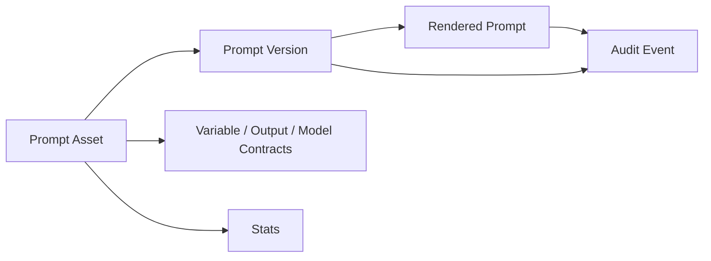
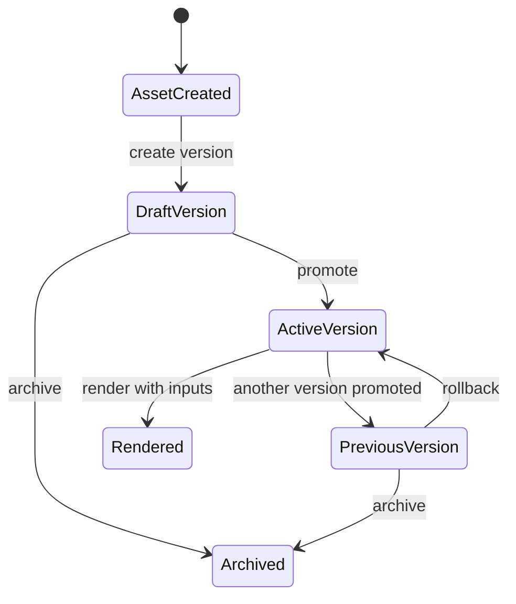

# PromptOps

**PromptOps is a prompt asset registry for AI products that need controlled prompt storage, versioning, rendering, rollback, and auditability.**

It is intentionally **not** an AI evaluation tool and it does **not** call an LLM. PromptOps manages prompt assets before they are used by agents, applications, or external evaluation systems.

## Why this exists

In real AI products, prompts quickly become production assets. They are edited, copied, tested, promoted, rolled back, reused by agents, and referenced in product decisions. Without a registry, teams lose answers to basic questions:

- Which prompt version is active right now?
- What changed between versions?
- Which variables are required to render this prompt safely?
- What exact prompt text was rendered for a specific run?
- Can we roll back after a bad release?
- Who changed what, and when?

PromptOps turns prompts into traceable product artifacts.

## What PromptOps does

| Capability | Purpose |
|---|---|
| **Asset registry** | Stores stable prompt assets with owner, tags, lifecycle, and contracts. |
| **Version control** | Creates draft versions, promotes one active version, archives old versions, and supports rollback. |
| **Template rendering** | Replaces `{{variables}}` with provided inputs and returns diagnostics. |
| **Audit trail** | Records important events so prompt changes and renders can be inspected later. |

## What PromptOps does not do

PromptOps does not evaluate prompt quality, compare outputs, run LLM calls, score rubrics, perform red teaming, or manage datasets. Those belong in a separate **AI Evaluation** tool.

```text
PromptOps = prompt storage, versions, contracts, rendering, audit
AI Evaluation = datasets, model runs, rubrics, LLM-as-judge, regression tests
```

## Core object model



## Main lifecycle



## Quick API flow

```bash
export PROMPTOPS_API_TOKEN="local-dev-token"
export BASE_URL="http://localhost:3013"
```

Create a prompt asset:

```bash
curl -X POST "$BASE_URL/api/v0/assets" \
  -H "Authorization: Bearer $PROMPTOPS_API_TOKEN" \
  -H "Content-Type: application/json" \
  -d '{
    "id": "shadow.daily-report",
    "owner": "shadow-agent",
    "description": "Daily reflection report prompt for Shadow.",
    "tags": ["shadow", "daily-report", "reflection"],
    "lifecycle": "active",
    "variable_contract": [
      { "name": "journal_entries", "kind": "string", "required": true },
      { "name": "language", "kind": "enum", "required": true, "values": ["English", "Russian", "Spanish"], "default": "English" }
    ],
    "model_config": { "model": "gpt-4.1", "temperature": 0.2 },
    "output_contract": { "format": "markdown", "sections": ["summary", "patterns", "next_actions"] }
  }'
```

Create a draft version:

```bash
curl -X POST "$BASE_URL/api/v0/assets/shadow.daily-report/versions" \
  -H "Authorization: Bearer $PROMPTOPS_API_TOKEN" \
  -H "Content-Type: application/json" \
  -d '{
    "version": "1.0.0",
    "body": {
      "system": "You are Shadow, a careful personal operating system assistant.",
      "user": "Create a daily report from {{journal_entries}}. Respond in {{language}}."
    },
    "variable_contract_snapshot": [
      { "name": "journal_entries", "kind": "string", "required": true },
      { "name": "language", "kind": "enum", "required": true, "values": ["English", "Russian", "Spanish"], "default": "English" }
    ],
    "model_config_snapshot": { "model": "gpt-4.1", "temperature": 0.2 },
    "output_contract_snapshot": { "format": "markdown" },
    "changelog": "Initial production-ready version."
  }'
```

Promote the draft version:

```bash
curl -X POST "$BASE_URL/api/v0/assets/shadow.daily-report/versions/<version_id>/promote" \
  -H "Authorization: Bearer $PROMPTOPS_API_TOKEN"
```

Render a version:

```bash
curl -X POST "$BASE_URL/api/v0/assets/shadow.daily-report/versions/<version_id>/render" \
  -H "Authorization: Bearer $PROMPTOPS_API_TOKEN" \
  -H "Content-Type: application/json" \
  -d '{
    "inputs": {
      "journal_entries": "I slept badly, finished the landing page, and felt anxious before the call.",
      "language": "English"
    },
    "save": true
  }'
```

## Documentation map

| Document | Purpose |
|---|---|
| [`docs/product-brief.md`](docs/product-brief.md) | Product framing, users, jobs, MVP, metrics. |
| [`docs/behavior-spec.md`](docs/behavior-spec.md) | Exact system behavior and non-behavior. |
| [`docs/architecture.md`](docs/architecture.md) | Layers, flows, responsibilities, diagrams. |
| [`docs/api-reference.md`](docs/api-reference.md) | Practical API guide based on the OpenAPI spec. |
| [`docs/wiki/prompt-lifecycle.md`](docs/wiki/prompt-lifecycle.md) | Asset and version lifecycle explained. |
| [`docs/wiki/contracts.md`](docs/wiki/contracts.md) | Variable, model, and output contracts. |
| [`docs/acceptance-criteria.md`](docs/acceptance-criteria.md) | Product-level acceptance criteria. |
| [`docs/test-cases.md`](docs/test-cases.md) | Manual/API test cases with expected results. |
| [`docs/roadmap.md`](docs/roadmap.md) | Roadmap and scope boundaries. |
| [`openapi/promptops.openapi.json`](openapi/promptops.openapi.json) | Original OpenAPI spec, formatted and renamed. |

## Portfolio positioning

PromptOps is a strong portfolio project because it shows the ability to separate AI product concerns correctly:

- Prompt management is treated as infrastructure.
- Evaluation is intentionally decoupled.
- Contracts make prompts safer to use in production.
- Audit and rollback make prompt changes operationally responsible.
- The API design is small, explainable, and close to real production needs.

## Current API version

- OpenAPI: `3.1.0`
- API title: `PromptOps API`
- API version: `0.2.0`
- Local server: `http://localhost:3013`
