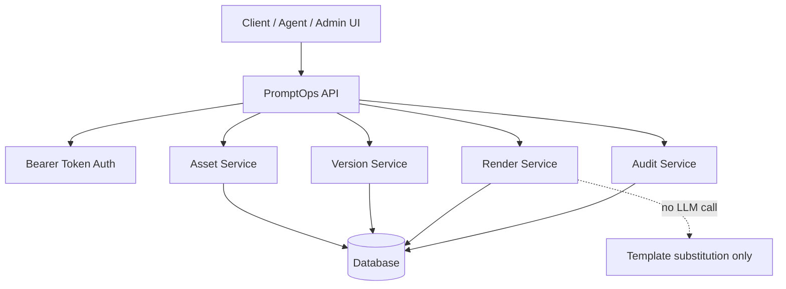
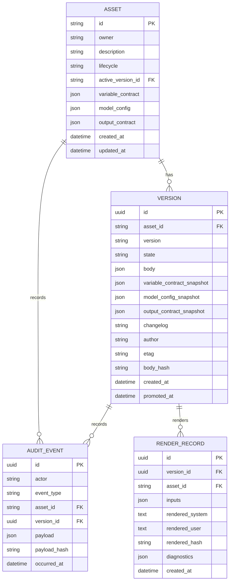
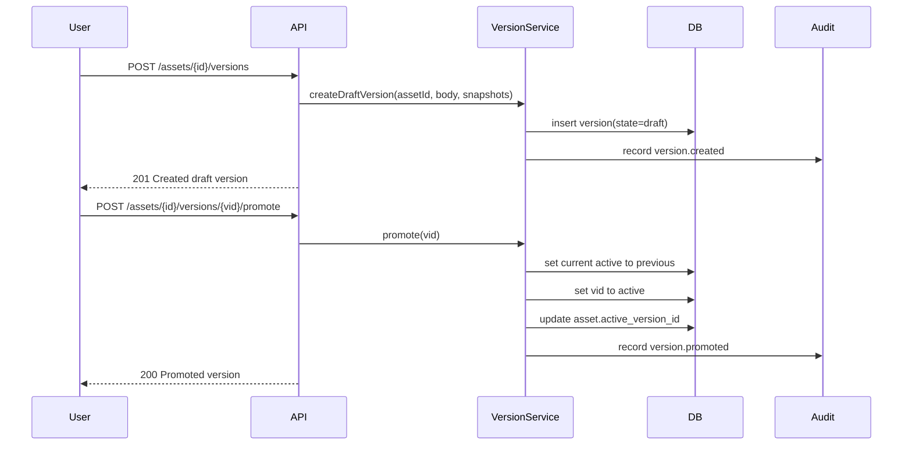
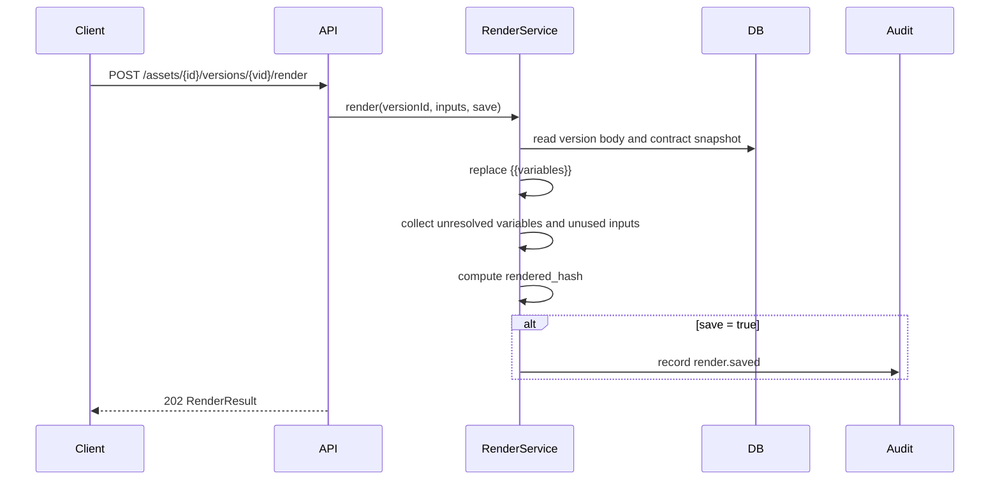
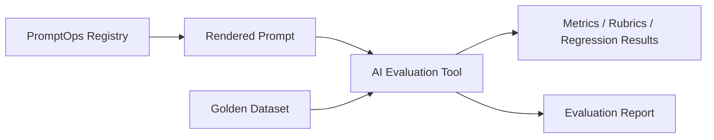

# Architecture — PromptOps

## Architecture summary

PromptOps is a small API service with four responsibilities: manage prompt assets, manage prompt versions, render prompt templates with variables, and record audit/stats data.

It should remain intentionally boring: predictable REST endpoints, explicit state transitions, deterministic rendering, and clear separation from LLM execution.

## High-level architecture

## Layer responsibilities

| Layer | Responsibility |
|---|---|
| API layer | Request routing, authentication, response envelope, input parsing. |
| Asset service | Asset CRUD, lifecycle updates, active version reference. |
| Version service | Draft creation, promotion, archive, rollback, version state transitions. |
| Render service | Variable substitution, diagnostics, rendered hash generation. |
| Audit service | Immutable event creation and retrieval. |
| Persistence layer | Stores assets, versions, audit events, and optional render records. |

## Suggested data model

## Create and promote version

## Render version

## Rendering algorithm

1. Load version by `asset_id` and `version_id`.
2. Extract all `{{variable}}` placeholders from `body.system` and `body.user`.
3. Validate provided inputs against `variable_contract_snapshot`.
4. Substitute placeholders with input values or defaults.
5. Leave unresolved placeholders detectable if values are missing.
6. Return rendered text, unresolved variables, unused inputs, and rendered hash.
7. Save audit/render record only if requested.

## Integration with AI Evaluation

PromptOps can provide the exact rendered prompt to an evaluation tool. The evaluation tool can run model calls, compare outputs, score rubrics, and store results.

## Suggested implementation stack

A simple implementation can use Node.js / Next.js API routes or Express, PostgreSQL or SQLite, Zod, OpenAPI, Vitest/Jest, and Playwright or Supertest.
