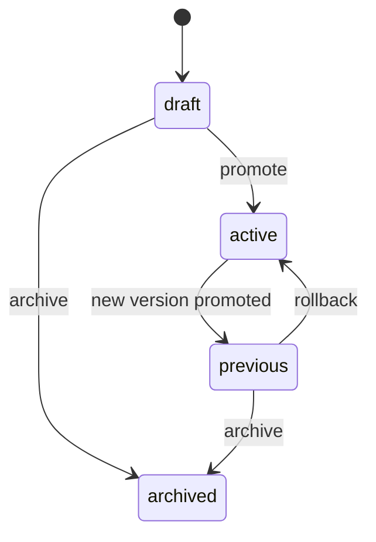

# Wiki — Prompt Lifecycle

## Mental model

PromptOps separates a prompt into two levels:

```text
Asset = stable product identity
Version = specific prompt text and contract snapshot
```

Example:

```text
Asset: shadow.daily-report
Version 1.0.0: initial daily report prompt
Version 1.1.0: improved tone and output structure
Version 1.2.0: added language control and stricter sections
```

## Naming assets

Use dot-namespaced IDs:

```text
product.feature.intent
```

Good examples: `shadow.daily-report`, `shadow.memory-extraction`, `shadow.task-breakdown`, `promptops.asset-summary`, `agent.support-triage`.

Avoid vague names: `prompt1`, `new-prompt`, `better-summary`, `final-final-v3`.

## Version strategy

| Change type | Version bump | Example |
|---|---|---|
| Small wording change | Patch | `1.0.0` → `1.0.1` |
| Added optional variable or output section | Minor | `1.0.0` → `1.1.0` |
| Breaking contract change | Major | `1.0.0` → `2.0.0` |

## Version states



## Promotion checklist

Before promoting a version, confirm that the prompt body is complete, required variables are declared, the template uses declared variables, example render works without unresolved variables, changelog explains the change, and external eval checks passed if connected.

## Rollback checklist

Rollback is appropriate when a promoted prompt causes production regressions, users receive malformed output, a required variable was removed or renamed, the prompt violates expected tone/structure, or the active version was promoted by mistake.

## Important rule

A prompt version should be treated like a release artifact. Do not silently mutate active prompt text without a version record.
